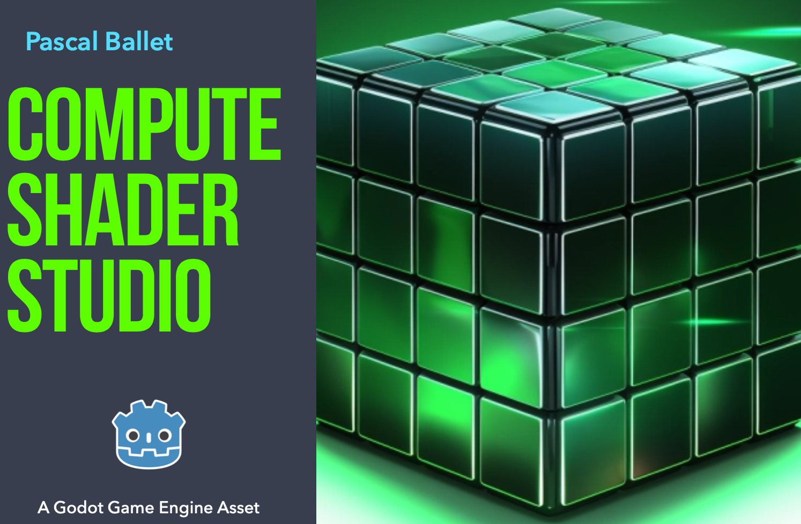

# Compute Shader Studio
 A plugin for Godot to create compute shaders
 

**[Compute Shader Studio](https://virtulab.univ-brest.fr) is an addon for Godot Engine that enables you to write Compute Shaders in a minute:**

**Read [the tutorial](doc/ComputeShaderStudio.pdf) or look at the 2 minutes video to make your first Compute Shader in Godot**

**Several examples are available: test them to understand how they work and what can be done**
